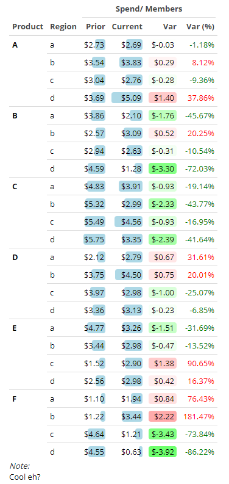

<!-- README.md is generated from README.Rmd. Please edit that file -->

```{r, include = FALSE}
knitr::opts_chunk$set(
  collapse = TRUE,
  comment = "#>",
  fig.path = "man/figures/README-",
  out.width = "100%"
)
```
# fidelis 

Automate data reporting with this R package!

## Installation

You can install the development version from [GitHub](https://github.com/) with:

```{r, eval = F}
# install.packages("devtools")
devtools::install_github("joshua-ruf/fidelis")
```

### New to R?

Follow these steps to get R and the fidelis package installed on Windows:

**First**, download and install the most recent version of R from [CRAN](https://cran.r-project.org). As of 7/12/2019 that is 3.6.1 -- if R is already installed run `R.version.string` to check your version. 

**Second**, install [RStudio](https://www.rstudio.com/products/rstudio/download/#download). This is not strictly necessary, but the fidelis package makes use of the rstudioapi package for handling passwords, so it's required to use some functions.

**Third**, Windows users need to install Rtools before installing the fidelis package. The installr package will handle the Rtools installation, simply run the code below and accept the default options.

```{r, eval = F}
install.packages('devtools')
# install devtools

if(Sys.info()['sysname'] == 'Windows' && !devtools::find_rtools()){
  install.packages('installr');
  installr::install.URL('https://cran.r-project.org/bin/windows/Rtools/Rtools35.exe')
  }
# install Rtools if not already installed; as of 7/12/2019 3.5 is the recommended version
```

**Fourth**, install fidelis from Github.

```{r, eval = F}
devtools::install_github('joshua-ruf/fidelis', dependencies = T)
```

**Fifth**, install [tidyverse](https://www.tidyverse.org/) and [openxlsx](https://www.rdocumentation.org/packages/openxlsx/versions/4.1.0.1). This is optional, but both are highly useful packages.

```{r, eval = F}
install.packages(c('tidyverse', 'openxlsx'))
```

## Example

At the heart of the fidelis package is really just an efficient integration of R with Greenplum/PostgreSQL. This section will serve as the `Hello World!` to just some of these functions. Throughout this tutorial I frequently make use of `%>%` from the magrittr package. This *pipe* allows us to split code onto multiple lines, making it easier to read (and also write). For example, `sum(x, y)` returns the same value as `x %>% sum(y)`.

We'll begin by creating a data.frame and uploading it to the database. 

```{r, warning = F, error = F, message = F}
library(data.table) #data manipulation
library(magrittr) #pipes
library(dplyr) #data manipulation
library(formattable) #number formatting/coloring
library(knitr) #basic table creation
library(kableExtra) #table formatting
library(fidelis)
```

```{r}
df <- expand.grid(stringsAsFactors = F,
  
  date = seq.Date(lubridate::round_date(Sys.Date(), 'month') - months(23),
                  lubridate::round_date(Sys.Date(), 'month'),
                  by = 'month'),
  product = LETTERS[1:6],
  region = letters[1:4]
) # 24 months of data for 6 products in 4 regions

n <- nrow(df) # number of rows in df

df <- df %>%
  data.table::as.data.table() %>%
  .[, `:=`(spend = runif(n = n)*1000,
           members = sample(100:200, size = n, replace = T))]
# add 2 new columns of random data, spend and members

fidelis::greenplum_connect(ask=F)
# create a greenplum connection object, note the result does not need to be assigned to an object
# the option ask=F tells the function not to ask for input but instead to look for a secret password
# see fidelis::create_secret() for more information.

fidelis::send_to_database(df, name = 'temptable')
# send df to the greenplum database as a temp table
# note: if name began with "sandbox." then the table would be permenant instead of temporary

fidelis::query("select * from temptable limit 5;")
# to run a SQL query pass sql code as a string through fidelis::query()
# assign to R object to save results
```

The `query()` function also has the ability to execute dynamic SQL queries. Suppose we want to run an analysis on only a couple of products in a certain region, we can create R vectors with that information and add those as options to the `query()` function.

```{r}
products <- c('A', 'B')
regions <- 'd'

df_limited <- fidelis::query(
  
  "
  select *
  from temptable
  where product in %product%
    and region = %region%
  ;
  ",
  product = products,
  region = regions

) # note how dynamic inputs are added, they must be named after the SQL text and surrounded by "%" in the SQL code

unique(df_limited[, c('product', 'region')])
# test to make sure the dynamic where clause was successful!
```

The dynamic queries are especially useful if we are interested in working with dates. Suppose now that we are interested in comparing the last 3 months of 2017 to the last three months of 2018. The fidelis functions `set_dates()` and `usdate()` will help us prepare these inputs.

```{r}
final_month <- as.Date('2018-12-01') # specify the final month we're interested in
rolling_window <- 3 # number of months to compare across years

dates_df <- final_month %>%
  fidelis::set_dates()

dates_df
```

`dates_df` is a data.table that assigns each month for the last 24 months to one of three categories: 'current' period, 'prior' period, and `NA` (neither). The four `col` columns differentiate between the number of months to include in the rolling window.

```{r}
dates_df <- dates_df[, c(1, 1 + rolling_window/3), with = F] %>%
  data.table::setnames(names(.), c('effper', 'col'))
# get the number of months rolling window based on the rolling_window object defined above.

current <- dates_df[col == 'current', effper] %>%
  fidelis::usdate()

prior <- dates_df[col == 'prior', effper] %>%
  fidelis::usdate()
# get only months that belong to the current and prior periods respectively
# also convert them to SQL friendly format with usdate()
```

Finally, we'll run the query, calculating the sum of spend and members, by period, product, and region. Since Greenplum is a distributed system most aggregations will be faster in Greenplum than R, especially as the size of the data increases. Bottom line: do as much of our calculations in SQL as you can.

```{r}
df_aggregated <- fidelis::query(
  
  "
  select case when date in %current% then 'current'
    else 'prior'
    end as col
    ,product
    ,region
    ,sum(spend) as spend
    ,sum(members) as members
  from temptable
  where (date in %current% or date in %prior%)
  group by 1,2,3
  ;
  ",
  current = current,
  prior = prior
  
)

head(df_aggregated, 10)
```

Great! One major limitation of this approach is that error handling can be quite difficult; a query will return an error but often the output does not fully display the error message. This problem lead to `madlib()`, a function that prepares the dynamic query but rather than send it to the Greenplum database, it prints to console. This makes it possible to copy and paste the query into another program for more thorough debugging. 

```{r}
fidelis::madlib(
  
  "
  select case when date in %current% then 'current'
    else 'prior'
    end as col
    ,product
    ,region
    ,sum(spend) as spend
    ,sum(members) as members
  from temptable
  where (date in %current% or date in %prior%)
  group by 1,2,3
  ;
  ",
  current = current,
  prior = prior

)
```

Fortunately, this query runs with no errors! Now let's create a summary table using formattable, knitr, kableExtra, and fidelis. A [great reference](https://haozhu233.github.io/kableExtra/awesome_table_in_html.html) was made by Hao Zhu.

```{r}
data.table::setDT(df_aggregated)
# set as data.table

df_aggregated[, spend_per_member := spend/members]
# create new spend_per_member column

df_wide <- fidelis::add_var_cols2(df_aggregated, vars = c('spend_per_member'))
# reshape long to wide and add var/var_pct column for specified variable

for(n in fidelis::names_with(names(df_wide), with = 'spend', without = 'pct')){
  data.table::set(df_wide, j = n, value = formattable::currency(df_wide[[n]]))
} #format spend variables (except spend_per_member_var_pct) as currency
```

Be sure to specify `results='asis'` as an option in the following Rmarkdown chunk for best results.

```{r results='asis', eval = F}
left_cols <- 2 #specify how many of the left most columns are left aligned (the rest are right algined)

df_wide %>%
  dplyr::mutate(
      spend_per_member_prior = formattable::color_bar('lightblue')(spend_per_member_prior),
      spend_per_member_current = formattable::color_bar('lightblue')(spend_per_member_current),
      spend_per_member_var = fidelis::red_green_tiles.r(spend_per_member_var),
      spend_per_member_var_pct = fidelis::red_green_text.r(spend_per_member_var_pct)
      ) %>% #apply colouring
  knitr::kable(
      escape = F, #necessary for html formatting to be read as html
      format = 'html',
      table.attr = "style = \"color: black;\"", #change font from grey to black
      col.names = c('Product', 'Region',
                    'Prior', 'Current', 'Var', 'Var (%)'),
      align = c(rep('l', left_cols),  rep('r', ncol(.) - left_cols)) #align columns left or right
      ) %>% 
  kableExtra::kable_styling(
      full_width = F,
      protect_latex = F, # useful for coloring formatting as well
      position = "left",
      bootstrap_options = c('condensed', 'hover')
      ) %>%
  kableExtra::column_spec(1, bold = T) %>%
  kableExtra::add_header_above(c(' ' = 2, 'Spend/ Members' = 4)) %>%
  kableExtra::collapse_rows(columns = 1, valign = 'top') %>%
  kableExtra::footnote(general = "Cool eh?") %>%
  htmltools::knit_print.html() #this is necessary for use with with results='asis'
```



To view all `fidelis` functions, simply run `help(package = 'fidelis')`. To learn more about a specific function run `?` followed by the function name (i.e. `?currency.auto`).

## Rmarkdown Templates

Included in the fidelis package are two Rmarkdown templates that you can use to make html reports, `dashboard` and `fidelis_toc`. They can easily be accessed in RStudio by going to:<br>
<br>
File >> New File >> R Markdown... >> From Template<br>
<br>
Once there, choose the template you'd like to use, optionally change the name and directory and then click OK.

The `dashboard` template creates a data dashboard using the `flexdashboard` package. A basic report might look like this:


The `fidelis_toc` template creates a report with a floating table of contents. It's a nice alternative to regular Rmarkdown tabs, especially when a report needs many tabs. Without modification the template would create an html report like this:


